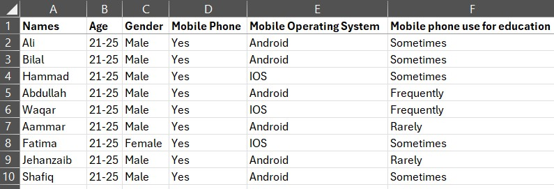
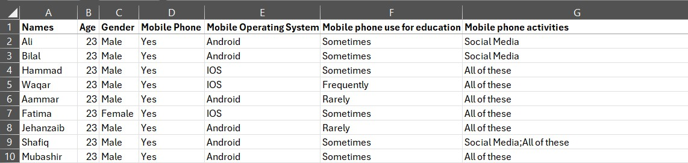

# learning_with_mobile_phones
This is study on the use of mobile phones for learning and how they impact the learning of students. Dataset was taken from "https://www.kaggle.com/datasets/innocentmfa/students-health-and-academic-performance"

# Before PowerQuery
Numbers are in ranges and still in text format.

#After PowerQuery
Numbers are the median of the range. And format is all in numerals. Some records with null blanks have been removed,

